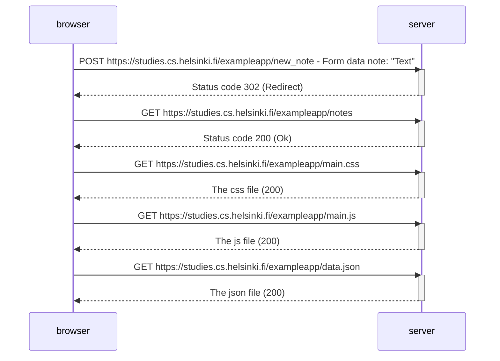

```mermaid

sequenceDiagram 
    participant browser
    participant server

    browser ->>server: POST https://studies.cs.helsinki.fi/exampleapp/new_note - Form data note: "Text"
    activate server
    server -->>browser: Status code 302 (Redirect)
    deactivate server
    browser ->>server: GET https://studies.cs.helsinki.fi/exampleapp/notes
    activate server
    server -->>browser: Status code 200 (Ok)
    deactivate server
    browser ->> server: GET https://studies.cs.helsinki.fi/exampleapp/main.css
    activate server
    server -->>browser: The css file (200)
    deactivate server
    browser ->> server: GET https://studies.cs.helsinki.fi/exampleapp/main.js
    activate server
    server -->>browser: The js file (200)
    deactivate server
    browser ->> server: GET https://studies.cs.helsinki.fi/exampleapp/data.json
    activate server
    server -->>browser: The json file (200)
    deactivate server

```