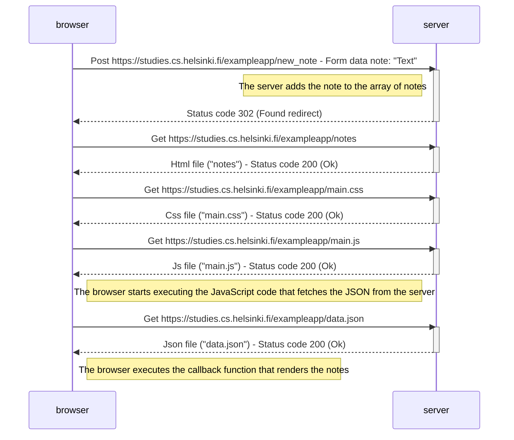

```mermaid

sequenceDiagram 
    participant browser
    participant server

    browser->>server: Post https://studies.cs.helsinki.fi/exampleapp/new_note - Form data note: "Text"
    activate server
    Note left of server: The server adds the note to the array of notes    
    server -->>browser: Status code 302 (Found redirect)
    deactivate server

    browser ->>server: Get https://studies.cs.helsinki.fi/exampleapp/notes
    activate server
    server-->>browser: Html file ("notes") - Status code 200 (Ok)
    deactivate server

    browser ->> server: Get https://studies.cs.helsinki.fi/exampleapp/main.css
    activate server
    server-->>browser: Css file ("main.css") - Status code 200 (Ok)
    deactivate server

    browser ->> server: Get https://studies.cs.helsinki.fi/exampleapp/main.js
    activate server
    server-->>browser: Js file ("main.js") - Status code 200 (Ok)
    deactivate server

    Note right of browser: The browser starts executing the JavaScript code that fetches the JSON from the server

    browser ->> server: Get https://studies.cs.helsinki.fi/exampleapp/data.json
    activate server
    server-->>browser: Json file ("data.json") - Status code 200 (Ok)
    deactivate server
    
    Note right of browser: The browser executes the callback function that renders the notes

```