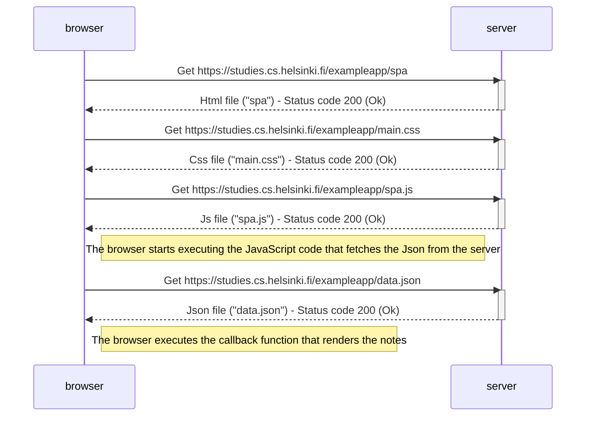

```mermaid

sequenceDiagram
  participant browser
  participant server

  browser->>server: Get https://studies.cs.helsinki.fi/exampleapp/spa
  activate server
  server-->>browser: Html file ("spa") - Status code 200 (Ok)
  deactivate server

  browser->>server: Get https://studies.cs.helsinki.fi/exampleapp/main.css
  activate server
  server-->>browser: Css file ("main.css") - Status code 200 (Ok)
  deactivate server

  browser->>server: Get https://studies.cs.helsinki.fi/exampleapp/spa.js
  activate server
  server-->>browser: Js file ("spa.js") - Status code 200 (Ok)
  deactivate server

  Note right of browser: The browser starts executing the JavaScript code that fetches the Json from the server

  browser->>server: Get https://studies.cs.helsinki.fi/exampleapp/data.json
  activate server
  server-->>browser: Json file ("data.json") - Status code 200 (Ok)
  deactivate server

  Note right of browser: The browser executes the callback function that renders the notes


```